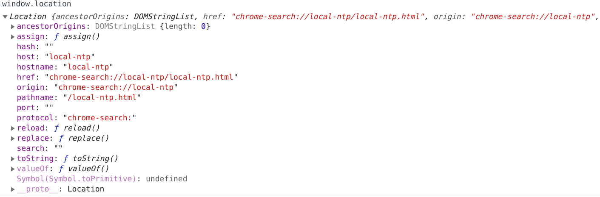

[TOC]

# DOM 操作

## dom 必知

此处大量借鉴 阿里 js dom 操作

### 1. 文档对象模型

当网页被加载时，浏览器会创建页面的文档对象模型（Document Object Model）。
HTML DOM 模型被结构化为对象树：


通过这个对象模型，JavaScript 获得创建动态 HTML 的所有力量：

-   JavaScript 能改变页面中的所有 HTML 元素
-   JavaScript 能改变页面中的所有 HTML 属性
-   JavaScript 能改变页面中的所有 CSS 样式
-   JavaScript 能删除已有的 HTML 元素和属性
-   JavaScript 能添加新的 HTML 元素和属性
-   JavaScript 能对页面中所有已有的 HTML 事件作出反应
-   JavaScript 能在页面中创建新的 HTML 事件

#### 查找元素

| 方法                                 | 描述                   |
| ------------------------------------ | ---------------------- |
| document.getElementById(id)          | 通过 id 获得元素       |
| document.getElementByTagName(name)   | 通过标签名字来获得元素 |
| document.getElementByClassName(name) | 通过类来获得元素       |

#### 改变元素

| 方法                                  | 描述                  |
| ------------------------------------- | --------------------- |
| element.innerHtml=new html content    | 改变元素的 inner Html |
| element.attribute=new value           | 改变 html 元素的属性  |
| element.setAttribute(attribute,value) | 改变 html 元素的属性  |
| element.style.property=new style      | 改变 css 样式         |

#### 添加和删除元素

| 方法                            | 描述             |
| ------------------------------- | ---------------- |
| document.createElement(element) | 创建 HTML 元素   |
| document.removeChild(element)   | 删除 HTML 元素   |
| document.appendChild(element)   | 添加 HTML 元素   |
| document.replaceChild(element)  | 替换 HTML 元素   |
| document.write(text)            | 写入 HTML 输出流 |

#### 添加事件处理程序

| 方法                                                   | 描述                            |
| ------------------------------------------------------ | ------------------------------- |
| document.getElementById(id).onclick = function(){code} | 向 onclick 事件添加事件处理程序 |

#### document 的一些属性

| 属性                     | 描述                   |
| ------------------------ | ---------------------- |
| document.baseURI         | 返回文档的绝对基准 URI |
| document.body            | 返回 \<body> 元素      |
| document.cookie          | 返回文档的 cookie      |
| document.doctype         | 返回文档的 doctype     |
| document.documentElement | 返回 \<html> 元素      |
| document.documentURI     | 返回文档的 URI         |
| document.URL             | 返回文档的完整 URL     |

## 项目目录

### demo1 在网页直接书写

注意： document.write()方法需要区分文档是否加载完毕
如果文档加载完毕，再调用 document.write() 就会覆盖原来写入的内容
在此例中，调用了 setTimeout() 就会导致在 setTiemout 中的回调函数如写在 windos.onload=funcation(){ ××× } 一样

### demo2 获得网页 dom 元素,并更改样式

1. 通过 tag 获得元素标签


在图片中的 0-2，h2_id1-h2_id3 中的属性 即为获得元素的属性，通过直接`.属性`获得属性内容，也可以直接使用`=`动态赋值
我们看到通过 tag 方法获得的结果是一个类似数组的对象,所以可以通过如下形式,得到**内部元素**：

```js
document.getElementByTagName('h2')[0].innerText
document.getElementByTagName('h2')['h2_id1'].innerText
document.getElementByTagName('h2').h2_id1.innerText
```

**为标签设置样式：**

```js
// 为标签设置一个css样式
document.getElementsByTagName('h2')[0].style.color = 'rgb(12, 119, 212)'
// 为标签设置多个css样式
document.getElementsByTagName('h2')[1].style.cssText =
	'color:red;font-size: 9px;'
document
	.getElementsByTagName('h2')[2]
	.setAttribute('style', 'color: yellow;font-size: 200%')
```

2. 通过 id 获得元素标签


此处由于是用过 id 获得元素内容，所以就会返回一个元素,如果两个相同 id 的标签（不要这样做），会返回最上边的

3. 通过类获得元素标签


可以看到通过类来获得元素一样是获得的类似数组的对象

4. 遍历 dom 获得的对象

至此为止我们一直说通过 getElements××× 得到的对象是类似数组的对象，我们查看*proto*


其实是没有数组的方法的，所以是不能使用 forEach 之类数组的方法的
我们可以通过其对象的 length 属性，使用 for 循环来遍历对象

```js {.line-numbers .highlight=[3,8]}
for (
	let index = 0;
	index < document.getElementsByClassName('h3_class').length;
	index++
) {
	document.writeln(
		'h3_class的内容: ' +
			document.getElementsByClassName('h3_class')[index].innerText
	)
	document.writeln('<br/>')
}
```

### demo3 使用选择器

js 使用选择器 有两个方法一个是 querySelector ，选择单个元素；另一个是 querySelectorAll 选择一个 list

我们主要看 list，如下图：


可以发现 querySelectorAll 和 getElements××× 不同， querySelectorAll 是有 forEach 方法的

示例代码：

```js
document.querySelectorAll('.h2_class').forEach((item, _) => {
	console.log(_ + ' index ' + item.innerHTML)
})
```

选择器的详细信息 可以看链接[^1],如果链接不在可以查看此链接[^2]

[^1]: https://www.cnblogs.com/codingcc1/p/11073083.html
[^2]: [selector](/static/html/js_selector.html)

### demo4 获得 更改 dom 属性

1. 修改样式

```js
document.querySelectorAll('.h2_class').forEach((element) => {
	element.setAttribute('style', 'color: #00FF00;font-size: 200%;')
})
```

2. 修改文本内容

```js
document.getElementById("h2_id1").innerText="update text"
})
```

3. 修改 html 内容

```js
document.getElementById('h3_id1').innerHTML =
	'<b>update text</b><br/><a href="http://www.baidu.com">百度</a>'
```

4. 修改 id

```js
document.getElementById('h3_id1').id = 'h3()id1'
```

5. 获得 css 样式

```js
console.log(document.getElementById('h2_id1').style)
console.log(document.getElementById('h2_id1').getAttribute('style'))
```

结果：


### demo5 动画演示

setInterval() 方法可按照指定的周期（以毫秒计）来调用函数或计算表达式。

```js
setInterval(code,millisec[,"lang"])
```

setInterval() 方法会不停地调用函数，直到 clearInterval() 被调用或窗口被关闭。由 setInterval() 返回的 ID 值可用作 clearInterval() 方法的参数。

完整的调用 demo：

```js
var id = setInterval(frame, 5)
function frame() {
	if (pos == 350) {
		clearInterval(id)
	} else {
		pos++
		elem.style.top = pos + 'px'
		elem.style.left = pos + 'px'
	}
}
```

### demo6 事件

1. 事件的使用

    1. 直接使用

    2. 使用函数

    3. 使用 getElement××× 的`.attribute` 方法

    ```js
    <h1 onclick="this.innerText='click'">点击事件</h1>
    <h1 onclick="my_click(this)">点击事件</h1>
    <h1 id="h1_id3">点击事件</h1>
    <script>
        let i=0
        function my_click(param) {
            if(i++%2===0){
                param.innerText='click'
            }else{
                param.innerText='点击事件'
            }
        }
        document.getElementById("h1_id3").onclick=function(){
            this.innerText='byId'
        }
    </script>
    ```

2. 事件类型

| 事件类型    | 描述                             |
| ----------- | -------------------------------- |
| onclick     | 点击事件                         |
| onload      | 用于用户进入页面                 |
| onunload    | 用于用户离开页面                 |
| onchange    | 内容改变时触发 适用于 imput 标签 |
| onmouseover | 鼠标移入                         |
| onmouseout  | 鼠标指针移出一个元素边界时触发   |
| onmousedown | 鼠标按下                         |
| onmouseup   | 鼠标松开                         |
| onfocus     | 获得鼠标焦点                     |
| onblur      | 失去鼠标焦点                     |
| ondblclick  | 鼠标双击左键                     |

> note：
>
> 1.  onload 和 onunload 详细用途
>     1.onload 事件可用于检测访问者的浏览器类型和浏览器版本，然后基于该信息加载网页的恰当版本。
>     2.onload 和 onunload 事件可用于处理 cookie。

### demo7 监听器

addEventListener() 方法为指定元素指定事件处理程序,且为元素附加事件处理程序而不会覆盖已有的事件处理程序。

特性：

1. 一个元素添加多个事件处理程序。
2. 一个元素添加多个相同类型的事件处理程序，例如两个 "click" 事件。
3. 可以向任何 DOM 对象添加事件处理程序而非仅仅 HTML 元素，例如 window 对象。
4. addEventListener() 方法使我们更容易控制事件如何对冒泡作出反应。
5. 当使用 addEventListener() 方法时，JavaScript 与 HTML 标记是分隔的，已达到更佳的可读性；即使在不控制 HTML 标记时也允许您添加事件监听器。
6. 您能够通过使用 removeEventListener() 方法轻松地删除事件监听器。

语法
`element.addEventListener(event, function, useCapture);`
第一个参数是事件的类型（比如 "click" 或 "mousedown"）。
第二个参数是当事件发生时我们需要调用的函数。
第三个参数是布尔值，指定使用事件冒泡还是事件捕获。此参数是可选的。

> 事件冒泡还是事件捕获？
> 在 HTML DOM 中有两种事件传播的方法：冒泡和捕获。
> 事件传播是一种定义当发生事件时元素次序的方法。假如 \<div> 元素内有一个 \<p>，然后用户点击了这个 \<p> 元素，应该首先处理哪个元素“click”事件？
> 在冒泡中，最内侧元素的事件会首先被处理，然后是更外侧的：首先处理 \<p> 元素的点击事件，然后是 \<div> 元素的点击事件。
> 在捕获中，最外侧元素的事件会首先被处理，然后是更内侧的：首先处理 \<div> 元素的点击事件，然后是 \<p> 元素的点击事件。

### demo8 dom 导航

即使用以下几个方法找到指定标签

| 方法                   | 描述           |
| ---------------------- | -------------- |
| parentNode             | 父节点         |
| childNodes[nodenumber] | 子节点们       |
| firstChild             | 第一个子节点   |
| lastChild              | 最后一个子节点 |
| nextSibling            | 下一个兄弟节点 |
| previousSibling        | 上一个兄弟节点 |

举例：


可以发现 childNodes 中有大量的 text 标签，这是源码中两个标签的空格，由于此我们可以直接使用`document.getElementById("h1_id").nextSibling.nextSibling.getElementsByTagName('p')` 先查找`body`第一个元素，再使用`getElementsByTagName`获得对应标签，如果直接使用 childNodes，返回的是一个数组，不能使用如`getElementsByTagName`的方法，必须先遍历

### demo9 操作 dom 节点

1. 创建一个元素节点

    ```js
    // 使用innerText
    let dom = document.createElement('p')
    dom.innerText = 'test'
    // 使用node
    let new_dom = document.createElement('p')
    let text = document.createTextNode('this is a new p')
    new_dom.appendChild(text)
    ```

2. 插入一个元素节点

    ```js
    // 如上一条 appendChild（node）会把node 插入到最后一个子节点后
    new_dom.appendChild(text)
    // 向前插入 把new_dom插入到 add id标签里的 a id 标签 之前
    document
    	.getElementById('add')
    	.insertBefore(new_dom, document.getElementById('a'))
    ```

3. 删除一个元素节点

    ```js
    <div id="div1">
    <p id="p1">这是一个段落。</p>
    <p id="p2">这是另一个段落。</p>
    </div>
    <script>
    var parent = document.getElementById("div1");
    var child = document.getElementById("p1");
    parent.removeChild(child);
    // 删除parent元素节点
    parent.remove()
    </script>
    ```

4. 替换一个元素

    ```js
    <div id="div1">
    <p id="p1">这是一个段落。</p>
    <p id="p2">这是另一个段落。</p>
    </div>
    <script>
    var para = document.createElement("p");
    var node = document.createTextNode("这是新文本。");
    para.appendChild(node);
    var parent = document.getElementById("div1");
    var child = document.getElementById("p1");
    parent.replaceChild(para, child);
    </script>
    ```

### window 对象

window 重要的对象或方法：

1. locatioon
   
   可以看到 location 可以直接调用的属性有 host、hostname、port、href、pathname 等
   除此意外可以直接调用如：`window.location.href='http://www.baidu.com'` 直接跳转网页
2. History
   history.back() - 等同于在浏览器点击后退按钮
   history.forward() - 等同于在浏览器中点击前进按钮
3. timer
   setTimeout(function, milliseconds)
   在等待指定的毫秒数后执行函数。
   setInterval(function, milliseconds)
   等同于 setTimeout()，但持续重复执行该函数。

    删除定时任务
    clearInterval() 方法使用从 setInterval() 返回的变量，clearTimeout 同理：

    ```js
     myVar = setInterval(function, milliseconds);
     clearInterval(myVar);
    ```

4. Cookies
   JavaScript 可以用 document.cookie 属性创建、读取、删除 cookie。
   通过 JavaScript，可以这样创建 cookie：
   `document.cookie = "username=Bill Gates";`
   您还可以添加有效日期（UTC 时间）。默认情况下，在浏览器关闭时会删除 cookie：
   `document.cookie = "username=John Doe; expires=Sun, 31 Dec 2017 12:00:00 UTC";`
   通过 path 参数，您可以告诉浏览器 cookie 属于什么路径。默认情况下，cookie 属于当前页。
   `document.cookie = "username=Bill Gates; expires=Sun, 31 Dec 2017 12:00:00 UTC; path=/";`
   通过 JavaScript 删除 cookie
   删除 cookie 非常简单。
   删除 cookie 时不必指定 cookie 值：
   直接把 expires 参数设置为过去的日期即可

其他 window 内容可以查看此链接[^3][^4],
也可以查看本地链接[^5][^6]
[^3]:https://www.jianshu.com/p/7c796f4ff810
[^4]:https://blog.csdn.net/qq_30100043/article/details/68486026
[^5]:[window](static/html/window.html)
[^6]:[event](static/html/event.html)
